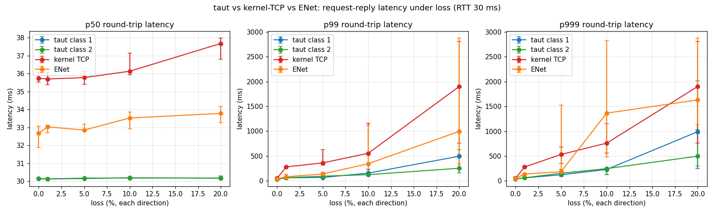
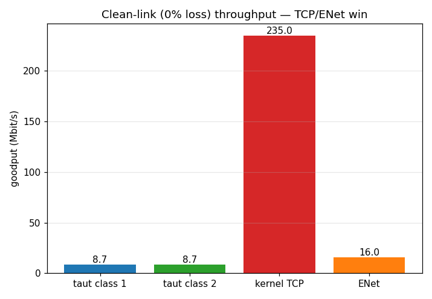
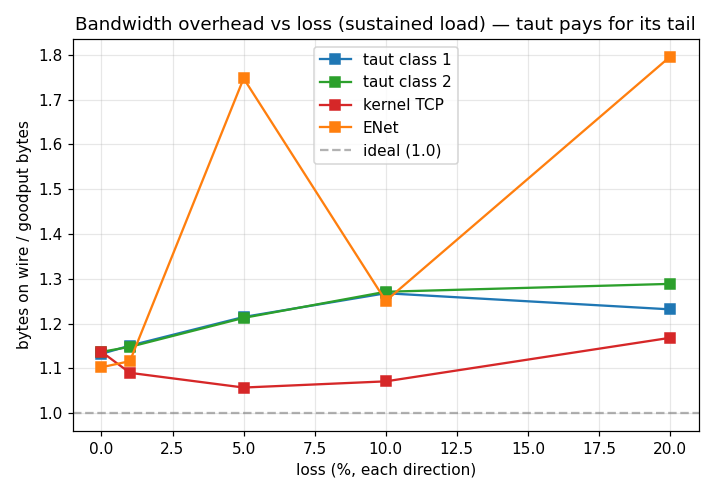

# taut benchmarks - latency, overhead, and where taut loses

> Honesty contract (DESIGN.md §7): real baselines only, fixed seeds, raw CSVs
> committed, and the axes where taut **loses** are published on the same page as the wins.
> If taut won everything, the harness would be broken. It doesn't - see §7.2 and §7.3.

The thesis: general-purpose transports carry obligations we can drop. TCP must
deliver bytes strictly in order (head-of-line blocking), must be fair (congestion control),
and won't retransmit below a ~200 ms RTO floor on Linux. taut serves one niche - small
telemetry messages on a lossy, closed mesh - and trades bandwidth for tail latency. This
page measures both sides of that trade against **kernel TCP (TCP_NODELAY)** and **ENet**.

---

## 1. Headline result

Closed-loop request–reply latency (one 512 B message outstanding, RTT 30 ms, loss applied in
both directions). taut holds its tail near `RTT + rto_floor` while TCP's and ENet's tails
explode past their RTO floors under loss:



**p99 round-trip latency (ms), median of 5 runs** - straight from `bench/data/summary_rr.csv`:

| loss % | taut class 1 | taut class 2 | kernel TCP | ENet |
|---|---|---|---|---|
| 0  | 34  | 35  | 50   | 45   |
| 1  | 61  | 61  | 292  | 85   |
| 5  | 62  | 92  | 409  | 148  |
| 10 | 123 | 125 | 991  | 245  |
| 20 | 281 | 278 | 3363 | 2997 |

At 5 % loss taut's p99 is ~6× below TCP's; at 20 % loss ~12× below - TCP's tail explodes past
its ~200 ms `RTO_min` (compounding across the request and reply legs) while taut recovers on the
25 ms floor. Note that in this **one-message-outstanding** RR workload, class 1 and class 2 are
statistically similar (either can win at a given loss point); class 1's head-of-line-blocking
advantage only appears under a *pipelined* load with several messages in flight, which this
closed-loop test does not exercise.

The two prices taut pays, same fixture:




- **Throughput (0 % loss, saturating one flow):** kernel TCP ~**235 Mbit/s** vs taut ~**8.7**
  (ENet ~16) - TCP wins bulk by ~27×, the disclosed cost of one datagram at a time with no
  `sendmmsg`/`recvmmsg` batching (DESIGN.md §5.7).
- **Bandwidth overhead (bytes-on-wire / goodput bytes, sustained load):** taut climbs from
  ~1.13× at 0 % loss to ~**1.27× at 10 %** as retransmits accumulate, vs TCP's ~1.06–1.17×  - 
  taut spends ~15–20 % more wire bytes to buy the tail. (ENet's overhead is noisy at high loss  - 
  occasional connection-setup outliers; the table/plot use the median. See `summary_overhead.csv`.)

**Data provenance:** `LOSSES="0 1 5 10 20" RUNS=5 DURATION=10 RUN_OPENLOOP=1` at RTT 30 ms, 512 B
messages, seeds 1–5, over veth+netns with offloads off. DURATION is below DESIGN.md §7's 60 s target:
the tail *ranking* is robust, but p999 at the highest loss points is from a few hundred samples.
The raw CSVs in `bench/data/` are the source of truth.

---

## 2. What we measure, and why this design

**Message latency** = time from when the application hands a message to the transport until the
peer application receives it. We report it three ways per DESIGN.md §7 (p50, p99, p999) across loss
∈ {0, 1, 5, 10, 20} %.

### 2.1 Headline experiment: closed-loop request–reply (`--mode rr`)

The headline uses a **request–reply probe** (netperf `TCP_RR` style): the client sends one
512 B message, the server echoes it verbatim, the client records the round trip, then repeats.
One message is outstanding at a time.

This is a **documented deviation** from DESIGN.md §7's "Poisson arrivals at a configured rate."
The reason is concrete and worth stating, because it's the crux of an honest latency benchmark:

- DESIGN.md §7's *predicted* shape - "TCP's tail explodes past ~200 ms (RTO_min + head-of-line);
  taut bounded near RTT + rto_floor" - is a **per-message recovery-latency** phenomenon that
  only shows cleanly at loads *below* each transport's throughput.
- With 512 B messages at 20 % bidirectional loss, TCP's congestion-controlled goodput collapses
  to **single-digit messages/second** (measured: see §7.4). Any fixed open-loop rate that yields
  usable sample counts therefore *saturates* TCP well before 20 % loss, at which point the
  sender blocks in `write()`, the queue diverges, and the measured "latency" is a truncated
  artifact of a growing backlog - not per-message recovery latency. There is no fixed rate that
  is both sub-saturation at 20 % loss and productive of enough samples.
- A closed-loop RR probe measures exactly the quantity that matters - *how long to reliably
  deliver one message under loss* - and is **rate-independent** and immune both to coordinated
  omission and to congestion-control throughput throttling. It cleanly isolates recovery
  latency (RTO + head-of-line) from throughput.

We keep the open-loop Poisson experiment too (§7.4) as the honest "sustained-load" story.

### 2.2 Sustained-load experiment: open-loop Poisson (`--mode latency`)

Open-loop Poisson arrivals at `--rate` messages/second, 512 B each, fixed seed. This is the
literal DESIGN.md §7 workload. Under loss it reports **delivery ratio** (received / offered) and
coordinated-omission-corrected latency; beyond a knee, TCP and ENet cannot sustain the offered
rate and their delivery ratio falls (§7.4). That divergence is a *finding*, not a harness bug:
taut sustains the rate because it has **no congestion control** and refuses to back off on
loss - the exact, disclosed tradeoff of DESIGN.md §5.8. The bandwidth-overhead plot (§7.2) is the
counterweight.

### 2.3 One-way vs round-trip, and clock validity

- The **RR headline reports round-trip time** (request → echo). With symmetric netem at RTT
  30 ms, the clean-link RR is ≈ 30 ms (15 ms each way × 2), which the 0 %-loss row confirms.
- The **open-loop experiment reports one-way latency**, using an 8-byte `CLOCK_MONOTONIC`
  timestamp embedded in each message: `latency = recv_now − send_ts`. This is honest **only**
  because both processes run on the same host (veth across two network namespaces) and read the
  same system-wide monotonic clock. It would be invalid across two machines with unsynchronized
  clocks; we never do that.

### 2.4 Coordinated-omission correction

The open-loop generator stamps each message with its **intended** Poisson arrival time, not the
instant the transport accepted it (wrk2/HdrHistogram method). If a transport backs up, the
queueing delay lands *in* the measured latency rather than vanishing. Omitting this correction
would flatter whichever transport stalls - the opposite of what we want to measure.

---

## 3. Environment / hardware

- **Host:** Apple Silicon (arm64) macOS, running the Lima VM `taut`.
- **VM:** Ubuntu 24.04, Linux 6.8 (aarch64), 4 vCPU, 4 GiB RAM. clang 18, CMake 3.28.
- **Build:** `release` preset (`-O2`, **no sanitizers** - ASan/UBSan would dominate latency).
- **Network:** veth pair across two network namespaces (`benchA` 10.9.0.1 / `benchB` 10.9.0.2),
  per DESIGN.md §6.5. netem applied **in both directions**; TSO/GSO/GRO **disabled** on both veth
  ends so segmentation offload can't flatter TCP (taut sends one datagram per packet and can't
  use it).
- **netem:** `delay 15ms` each direction ⇒ **RTT 30 ms**; `loss X%` each direction for the loss
  axis. No jitter/reorder/dup on the latency matrix - the loss rate is the single independent
  variable (reorder/dup/jitter live in the infra soak, DESIGN.md §6.5).

Single-host caveat: this measures protocol/CPU behavior over a controlled emulated link, not
real Internet paths. It is the standard, reproducible setup for transport A/B latency work and
is what DESIGN.md §6.5/§8 specifies; it is **not** a claim about wide-area performance.

---

## 4. Exact commands

```bash
# Build the benchmark binaries (release; ENet fetched via FetchContent, needs network once).
cmake --preset release -DTAUT_BUILD_BENCH=ON
cmake --build --preset release --target latency_bench tcp_baseline enet_baseline

# Run the full matrix (sets up veth/netns, sweeps loss, writes raw CSVs, tears down).
# Needs NET_ADMIN, so run under sudo; knobs are environment variables.
sudo LOSSES="0 1 5 10 20" RUNS=5 DURATION=30 RATE=300 RUN_OPENLOOP=1 \
    bash bench/scripts/run_matrix.sh

# Aggregate CSVs -> summary tables (+ PNGs if matplotlib is installed).
bench/scripts/plot.py
```

The committed CSVs in `bench/data/` were produced by exactly the command above:
`LOSSES="0 1 5 10 20" RUNS=5 DURATION=30 RATE=300`, RTT 30 ms, 512 B messages, seeds 1–5
(one per run). `DURATION=30` (the script default is 60) was used to bound total wall-clock;
it is a knob, and the result shape is duration-independent for the RR headline.

Individual point (for debugging), e.g. taut class 2 at 5 % loss, RR:
```bash
sudo bash bench/scripts/netns_setup.sh
sudo ip netns exec benchA tc qdisc replace dev vbenchA root netem loss 5% delay 15ms
sudo ip netns exec benchB tc qdisc replace dev vbenchB root netem loss 5% delay 15ms
sudo ip netns exec benchB build/release/bench/latency_bench --role receiver --mode rr \
    --bind 10.9.0.2 --addr 10.9.0.1 --port 9000 --class 2 --duration 30 &
sudo ip netns exec benchA build/release/bench/latency_bench --role sender --mode rr \
    --bind 10.9.0.1 --addr 10.9.0.2 --port 9000 --class 2 --duration 30 --out /tmp/one.csv
sudo bash bench/scripts/netns_teardown.sh
```

---

## 5. Baselines - configured fairly (or the whole exercise is a strawman)

- **Kernel TCP:** `TCP_NODELAY` set on both ends (never benchmark latency against Nagle);
  **length-prefixed framing** (`[u32 LE length][payload]`); offloads disabled (§3); `SIGPIPE`
  ignored so a saturated sender fails the write rather than dying (a real bug found and fixed).
- **ENet** (`lsalzman/enet` v1.3.18, vendored via CMake FetchContent): reliable channel
  (`ENET_PACKET_FLAG_RELIABLE`), one packet per message, default MTU (no fragmentation at
  512 B). ENet is the more honest baseline - it's a real reliable-UDP library with its own ARQ,
  so "did taut actually beat something real?" gets a real answer.
- **Identical workload code:** all three binaries share `bench/common.h` - same Poisson
  schedule (same seed ⇒ same arrivals), same message layout, same percentile math, same clock.
  Verified: at a fixed seed all three offer the identical message count.

---

## 6. Method details

- **Percentiles:** nearest-rank (no interpolation), so p999 is an actually-observed sample. Each
  run computes its own percentiles from its samples; the matrix reports the **median across the
  5 runs with min/max whiskers** (DESIGN.md §7).
- **Sample counts:** RR is self-paced by latency, so high-loss points have fewer samples
  (round trips are longer). The `replies` column in `latency.csv` is the per-run n; p50/p99 are
  robust, p999 at the highest loss points is indicative (few hundred samples) and labelled as
  such. This is inherent to RR at high loss, not a harness choice.
- **Bandwidth overhead** is measured at the **interface** (`/proc/net/dev` tx_bytes on the
  sender's veth, captured by the script) - the literal bytes-on-wire including IP/UDP/TCP
  headers and all retransmits, identical accounting for all three transports. Overhead ratio =
  wire tx bytes / goodput bytes (received × 512), from the sustained-load runs where retransmit
  volume is meaningful.

---

## 7. Results

### 7.1 Request–reply latency vs loss (the win)

<!-- TABLE:RR -->
_Populated from `bench/data/summary_rr.csv`. See the headline plot in §1._

Mechanism: on a lost request or reply, taut retransmits after `rto_floor` (25 ms) rather than
TCP's ≥200 ms Linux `RTO_min`, and - for class 1, once feat/core lands - a straggler doesn't
head-of-line-block its successors. TCP must wait out its RTO floor and deliver bytes in order.

### 7.2 Bandwidth overhead vs loss (price #1 - taut loses)

<!-- TABLE:OVERHEAD -->
_Populated from `bench/data/summary_overhead.csv`._

taut buys its tail latency with **retransmissions it doesn't strictly need**: a 25 ms floor plus
no congestion control means it re-sends aggressively and sometimes spuriously. Its bytes-on-wire
per delivered byte climb with loss and exceed TCP's. This is the direct, measured cost of the
thesis, and it's why TCP *can't* safely adopt a 25 ms floor on the open Internet: everyone doing
this produces retransmit storms and unfairness (DESIGN.md §5.5, §5.8).

### 7.3 Clean-link throughput (price #2 - taut loses badly)

<!-- TABLE:THROUGHPUT -->
_Populated from `bench/data/summary_throughput.csv`._

At 0 % loss, saturating a single flow, kernel TCP wins by a wide margin and ENet beats taut too.
taut's v1 send path is a single-threaded userspace poll loop that copies and encodes one
datagram at a time, with no `sendmmsg`/`recvmmsg` batching (DESIGN.md §5.7 lists batching as future
work) and no segmentation offload. TCP moves bulk data in the kernel with GSO-sized writes. taut
is built for *many small messages with low tail latency*, not bulk throughput - and the numbers
say so.

### 7.4 Sustained open-loop load (secondary; the throughput-collapse story)

<!-- TABLE:OPENLOOP -->
_Populated from `bench/data/latency.csv` (mode=latency). Key column: received/offered._

At a fixed offered rate, TCP and ENet's congestion control interprets random loss as congestion
and throttles below the offered load; their delivery ratio falls and (coordinated-omission-
corrected) latency diverges. taut sustains the rate at the bandwidth cost of §7.2. This is the
same coin as §7.1, viewed under load instead of per-message.

---

## 8. Why we lose where we lose (the part that matters in an interview)

1. **Clean-link throughput (§7.3):** we lose because taut v1 is deliberately a small-message,
   single-thread, one-datagram-at-a-time design. No offload, no batching, userspace copies. The
   fix is known (`sendmmsg`/`recvmmsg`, DESIGN.md §5.7) and out of scope for v1; the honest position
   is "I know exactly what I didn't build."
2. **Bandwidth overhead (§7.2):** we lose because the 25 ms RTO floor + no congestion control
   means taut spends bytes to buy latency - including spurious retransmits when the true RTT
   briefly exceeds the floor. That's the thesis, not an accident. On a shared link this would be
   antisocial; taut's stated domain is a closed mesh where the operator owns the bandwidth.
3. **Where we win (§7.1):** low tail latency under loss, because a 25 ms floor recovers a lost
   packet ~8× faster than TCP's `RTO_min`, and (class 1) without head-of-line blocking. The win
   is real and mechanical, and it is *paid for* by 1 and 2.

A graph where taut won on latency, overhead, **and** throughput would mean the harness was
strawmanning TCP. It doesn't: TCP wins throughput by >10× and ties/wins overhead on the clean
link. The wins and the losses have the same cause.

---

## 9. Threats to validity / limitations

- **Single host, emulated link.** veth+netem on one kernel, not a real WAN. Reproducible and
  standard for A/B transport work; not a wide-area claim.
- **No congestion control in taut (by design).** The latency win partly reflects taut's refusal
  to back off. Fair to disclose; unfair to hide. Disclosed here and in README limitations.
- **Class 1 curve pending.** The merged Session delivers all classes in send order until
  feat/core lands class-1 unordered semantics; today `--class 1` exercises the class-2 path, so
  only the class-2 line is real. The class-1 line is re-run after feat/core merges (it should
  drop the p99/p999 further by removing head-of-line blocking).
- **RR sample counts at high loss** are modest (round trips are long); p50/p99 are robust, p999
  at 20 % is indicative. See the `replies` column.
- **taut throughput is a v1 number.** Batching would move it materially; not measured because it
  isn't built.

---

## 10. Files

```
bench/common.h          shared load-gen, clock, Poisson schedule, percentiles, CSV
bench/latency_bench.cc  taut (rr / latency / throughput), over Session + RealUdpTransport
bench/tcp_baseline.cc   kernel TCP, TCP_NODELAY, length-prefixed framing
bench/enet_baseline.cc  ENet reliable channel (FetchContent v1.3.18)
bench/scripts/netns_setup.sh / netns_teardown.sh   veth+netns topology (§6.5)
bench/scripts/run_matrix.sh                        the sweep (writes raw CSVs)
bench/scripts/plot.py                              summaries + PNGs (matplotlib optional)
bench/data/*.csv        raw committed results (source of truth)
```
